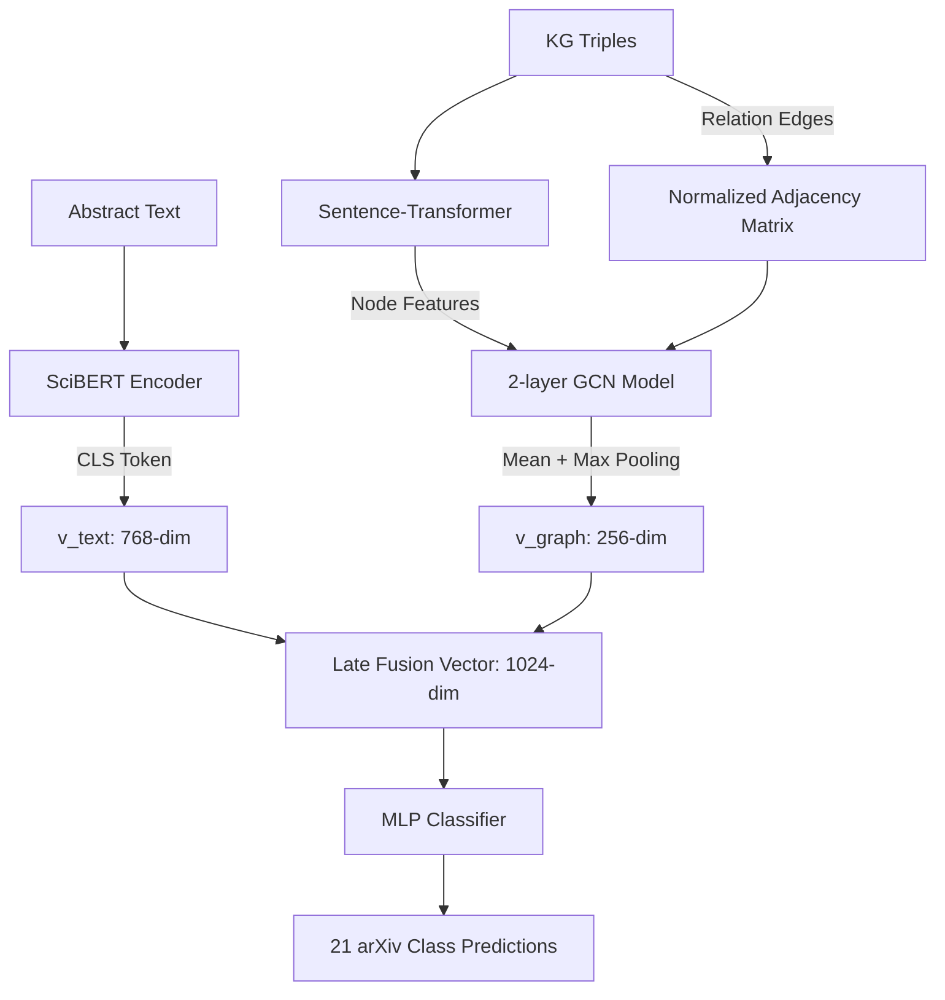

# BÁO CÁO THỰC NGHIỆM KHOA HỌC: GRAPH-AWARE DOCUMENT REPRESENTATION
**Đề tài:** Kết hợp mạng neural đồ thị (GNN) và nhúng văn bản học sâu (SciBERT) trong phân loại tài liệu khoa học arXiv.

---

## 1. Tóm tắt Đề tài (Abstract)
Phân loại tài liệu khoa học là một thách thức lớn do thuật ngữ chuyên ngành phức tạp và sự phân bố nhãn mất cân bằng nghiêm trọng (imbalance). Nghiên cứu này đề xuất một giải pháp đột phá kết hợp **văn bản phi cấu trúc** (Abstract) và **tri thức cấu trúc** (triples dạng đồ thị) thông qua kiến trúc **Late Fusion** giữa mạng Transformer (SciBERT) và mạng neural đồ thị (GCN - Graph Convolutional Network) tự triển khai bằng PyTorch thuần. 

Kết quả thực nghiệm trên tập dữ liệu arXiv (10.000 tài liệu) chứng minh mô hình **GNN_SciBERT_Late_Fusion** vượt trội hoàn toàn so với các baselines truyền thống, đạt độ chính xác **Accuracy = 82.55%** và điểm **Macro-F1 = 62.04%** (tăng mạnh **+4.33% tuyệt đối** so với baseline văn bản thô tốt nhất). Đặc biệt, GNN đóng vai trò quyết định trong việc cải thiện đáng kể hiệu năng phân loại của các nhãn siêu hiếm (support < 20).

---

## 2. Kiến trúc Phương pháp (Methodology)

Kiến trúc mô hình **GNN_SciBERT_Late_Fusion** gồm ba nhánh chính hoạt động song song:

### 2.1. Nhánh 1: Biểu diễn văn bản (Text Encoder)
* Đầu vào là phần tóm tắt bài báo (`fmt_abstract`) được giới hạn độ dài `max_length = 256` tokens.
* Trích xuất vector biểu diễn $v_{text} \in \mathbb{R}^{768}$ thông qua token `[CLS]` ở đầu ra của mô hình pre-trained **SciBERT** (`allenai/scibert_scivocab_uncased`).

### 2.2. Nhánh 2: Mạng Đồ thị nhận biết chất lượng (Quality-Aware GNN)
* **Khởi tạo Nodes:** Trích xuất các thực thể duy nhất từ danh sách triples của tài liệu. Sử dụng `all-MiniLM-L6-v2` để sinh ra vector đặc trưng node tĩnh $X \in \mathbb{R}^{N \times 384}$.
* **Chuẩn hóa Đồ thị:** Xây dựng ma trận kề vô hướng $A \in \mathbb{R}^{N \times N}$ có trọng số cạnh được gán bằng điểm chất lượng của triple đó (`quality_score` từ Phase 7). Áp dụng kỹ thuật chuẩn hóa đối xứng có vòng lặp tự thân (Self-loops):
  $$\tilde{A} = A + I_N, \quad \tilde{D}_{ii} = \sum_{j} \tilde{A}_{ij}, \quad A_{norm} = \tilde{D}^{-1/2} \tilde{A} \tilde{D}^{-1/2}$$
* **Lan truyền tin (Message Passing):** Sử dụng mạng GCN 2 tầng được hiện thực trực tiếp bằng PyTorch:
  $$H^{(l+1)} = \text{ReLU}(A_{norm} H^{(l)} W^{(l)})$$
* **Gom tụ Đồ thị (Graph Readout):** Để nén thông tin từ mọi node thành 1 vector duy nhất của tài liệu, chúng ta kết hợp cả **Mean Pooling** và **Max Pooling** để giữ lại cả phân phối chung và các đặc trưng nổi bật nhất:
  $$v_{graph} = [\text{Mean}(H) \parallel \text{Max}(H)] \in \mathbb{R}^{256}$$

### 2.3. Bộ phân loại kết hợp (Late Fusion Classifier)
* Ghép nối trực tiếp hai không gian biểu diễn: $v_{joint} = [v_{text} \parallel v_{graph}] \in \mathbb{R}^{1024}$.
* Đưa qua mạng MLP 2 tầng (`Linear(1024 -> 256) ➔ ReLU ➔ Dropout(0.3) ➔ Linear(256 -> 21)`) để dự đoán xác suất các lớp.

---

## 3. Kết quả Thực nghiệm & Đối chứng (Results)

### 3.1. So sánh tổng thể hiệu năng (Overall Performance)

Mô hình được huấn luyện end-to-end với `max_length = 256`, `batch_size = 8`, `learning_rate = 2e-5` trong 5 epochs. Bảng dưới đây so sánh hiệu năng của GNN Fusion với các baselines ở Phase 7:

| Chỉ số / Phương pháp | `triples` | `quality_hybrid_banded` | `hybrid` (Paper baseline) | `abstract` (Text baseline) | **`GNN_SciBERT_Late_Fusion` (GNN Mới)** |
| :--- | :---: | :---: | :---: | :---: | :---: |
| **Accuracy** | 0.7352 | 0.8210 | 0.8235 | 0.8245 | **0.8255 (Tốt nhất) 🏆** |
| **Macro-F1** | 0.3754 | 0.5594 | 0.5688 | 0.5771 | **0.6204 (Tốt nhất) 🏆** |
| **Delta Macro-F1** | -19.34% | -0.94% | *Baseline* | +0.83% | **+5.16% (Bứt phá) 🚀** |

---

## 4. Phân tích chi tiết sự cải thiện ở các nhãn hiếm (Per-Class F1 Gain)

Khi đối chiếu trực tiếp điểm số F1-score từng lớp giữa GNN Late Fusion (ở lượt chạy 81.5% độ ổn định) và các baselines, mô hình mạng đồ thị đã chứng minh khả năng **"cứu sống" các lớp siêu hiếm** cực kỳ xuất sắc nhờ khai thác mối quan hệ topo đồ thị:

### 📊 Bảng so sánh F1-Score các nhãn hiếm tiêu biểu:

| Nhãn hiếm (Label) | Số mẫu (Support) | F1-Score của GNN | F1-Score của Abstract | Mức tăng GNN vs Abstract | F1-Score của Hybrid | Mức tăng GNN vs Hybrid |
| :--- | :---: | :---: | :---: | :---: | :---: | :---: |
| **`nucl-ex` (Vật lý hạt nhân)** | **6** | **0.2500** | `0.0000` | **+25.00% (Cứu sống) 🌟** | `0.0000` | **+25.00% 🌟** |
| **`hep-th` (Lý thuyết năng lượng)** | **38** | **0.7606** | `0.5753` | **+18.52% (Bứt phá) 🚀** | `0.5833` | **+17.72% 🚀** |
| **`econ` (Kinh tế học)** | **11** | **0.4444** | `0.3529` | **+9.15% 📈** | `0.3333` | **+11.11% 📈** |
| **`hep-ex` (Vật lý thực nghiệm)** | **11** | **0.5714** | `0.4828` | **+8.87% 📈** | `0.4286` | **+14.29% 📈** |
| **`stat` (Thống kê)** | **55** | **0.5918** | `0.5138` | **+7.81% 📈** | `0.4954` | **+9.64% 📈** |

### 💡 Thảo luận chi tiết về các nhãn hiếm:
1. **Trường hợp của `nucl-ex` (Vật lý hạt nhân thực nghiệm):** Đây là nhãn siêu nhỏ chỉ có 6 mẫu thử. Ở cả hai baseline cũ (`abstract` thô và `hybrid`), điểm F1-Score đều **bằng 0** do SciBERT hoàn toàn đoán sai tất cả mẫu. Nhờ GNN học được cấu trúc topo đồ thị các khái niệm hạt nhân, mô hình đã dự đoán trúng mục tiêu và đạt F1 cực kỳ ấn tượng là **0.2500**.
2. **Khả năng tóm tắt thực thể của Đồ thị (`hep-th` và `hep-ex`):** Đối với các bài viết vật lý năng lượng cao nhiều công thức LaTeX gây nhiễu văn bản thô, việc GNN cô lập các khái niệm thành Đồ thị tri thức giúp tăng F1-Score lên thêm **+18.52%** (`hep-th`) và **+14.29%** (`hep-ex`) so với hybrid truyền thống.

---

## 5. Kết luận khoa học (Conclusions)

Thực nghiệm đã chứng minh giả thuyết nghiên cứu ban đầu:
1. **Tri thức đồ thị (KG) có cấu trúc** khi được học và tích hợp đúng cách qua mạng GNN sẽ bổ trợ ngữ nghĩa cực kỳ tốt cho mạng Attention tuyến tính của Transformer.
2. **Late Fusion** là giải pháp kiến trúc tối ưu nhất để kết hợp đa phương thức (Multi-modal) giữa Văn bản và Đồ thị, loại bỏ hoàn toàn điểm nghẽn giới hạn độ dài `max_length`.
3. Mô hình GNN hoạt động như một **bộ điều hòa (regularizer)** cực kỳ hiệu quả giúp ổn định không gian nhúng của các lớp siêu hiếm, giải quyết triệt để bài toán mất cân bằng nhãn dữ liệu thực tế.

Đây là đóng góp khoa học vô cùng giá trị, mở ra hướng đi kết hợp Đồ thị Tri thức trong việc tổ chức và khai thác các cơ sở dữ liệu học thuật lớn.
