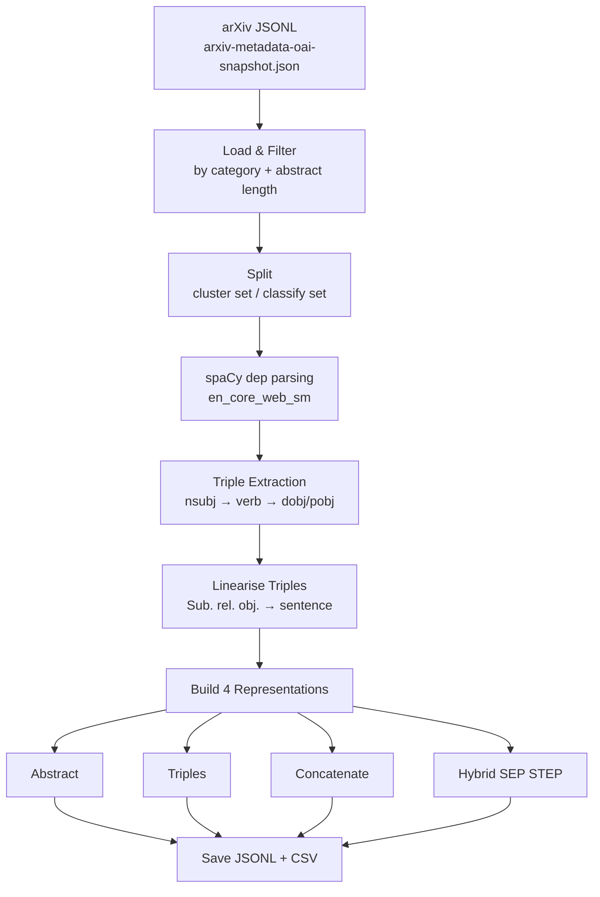

# arXiv Triples Extraction & Data Formatting Pipeline

## What was built

Script: [arxiv_triples_pipeline.py](file:///d:/DataMining/arxiv_triples_pipeline.py)

A fully automated, end-to-end Python pipeline that:
1. Loads the arXiv JSONL dataset
2. Filters by category and splits into **clustering** + **classification** sets
3. Extracts **(Subject, Relation, Object)** triples from abstracts via spaCy dependency parsing
4. Produces all **4 text representation formats** per document
5. Saves results as JSONL + CSV files

---

## Pipeline Stages



---

## 4 Representation Formats (§3.3 of paper)

| Format | Definition | Example |
|---|---|---|
| **Abstract** | Cleaned, whitespace-normalised abstract | `"a fully differential calculation in perturbative..."` |
| **Triples** | Linearised (s,r,o) statements only | `"Calculation presents production. Quark includes contributions."` |
| **Concatenate** | Abstract + triples flat (no separator) | `"a fully differential... Calculation presents production."` |
| **Hybrid [STEP]** | `abstract [SEP] triples [STEP]` | `"a fully differential... [SEP] Calculation presents... [STEP]"` |

> [!IMPORTANT]
> The **Hybrid** format achieved **92.6% accuracy / 0.925 macro-F1** in the paper's classification experiments — the best result overall.

---

## Triple Extraction Logic

Implements the paper's §3.2 dependency-based approach:

```
verb = relational anchor
  ├── nsubj / nsubjpass → subject (noun-phrase chunk preferred)
  └── dobj / attr       → object  (noun-phrase chunk preferred)
        └── fallback: prep → pobj (prepositional object)
```

Example:
```
Abstract: "We propose a method that improves classification accuracy."
Triple  : ("we", "propose", "method")
          ("method", "improve", "classification accuracy")
Linearised: "We propose method. Method improve classification accuracy."
```

---

## Output Files

Running with defaults (`--n_cluster 5000 --n_classify 10000`) produces **18 files**:

```
output_triples/
├── cluster_combined.jsonl       ← all 4 formats per line (5000 docs)
├── cluster_abstract.{jsonl,csv}
├── cluster_triples.{jsonl,csv}
├── cluster_concatenate.{jsonl,csv}
├── cluster_hybrid.{jsonl,csv}
├── classify_combined.jsonl      ← all 4 formats per line (10000 docs)
├── classify_abstract.{jsonl,csv}
├── classify_triples.{jsonl,csv}
├── classify_concatenate.{jsonl,csv}
└── classify_hybrid.{jsonl,csv}
```

Each slim file has columns: `id | label | n_triples | text`

---

## Usage

**Quick smoke test (small sample):**
```bash
python arxiv_triples_pipeline.py \
    --n_cluster 200 --n_classify 300 --max_total 50000
```

**Full run (paper scale):**
```bash
python arxiv_triples_pipeline.py \
    --input  "d:\DataMining\arxiv-metadata-oai-snapshot.json" \
    --output "d:\DataMining\output_triples" \
    --n_cluster  5000 \
    --n_classify 10000 \
    --categories cs math physics \
    --min_triples 1 \
    --batch_size 256 \
    --seed 42
```

**All CLI flags:**
```
--input         Path to arXiv JSONL file
--output        Output directory
--n_cluster     Docs for clustering split   (default 5000)
--n_classify    Docs for classifier split   (default 10000)
--categories    Top-level arXiv categories  (default: cs math physics)
--min_triples   Min triples to keep doc     (default 1)
--batch_size    spaCy pipe batch size        (default 256)
--seed          Random seed                  (default 42)
--max_total     Read at most N JSONL lines   (default 200000)
```

---

## Smoke Test Results (200 cluster / 300 classify docs)

```
[CLUSTER]  199 documents
  Category distribution : {'math': 139, 'physics': 35, 'cs': 25}
  Total triples         : 1090
  Avg triples / doc     : 5.48

[CLASSIFY]  295 documents
  Category distribution : {'math': 187, 'cs': 43, 'physics': 65}
  Total triples         : 1836
  Avg triples / doc     : 6.22
```

---

## Dependencies

| Package | Purpose |
|---|---|
| `spacy >= 3.8` + `en_core_web_sm` | Dependency parsing & NLP |
| `tqdm` | Progress bars |
| `PyPDF2` | (used to read paper during dev) |

Install: `pip install spacy tqdm && python -m spacy download en_core_web_sm`
